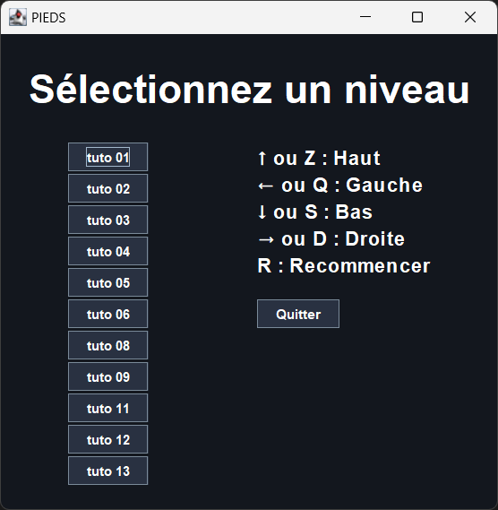
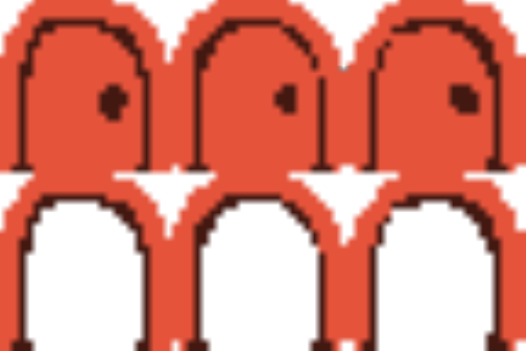

# PIEDS (Projet Informatique Encadré Dorian Sacha)

Le but du projet était de créer une application Java en respectant les designs patterns MVC et Observer/Observable. Le jeu est un Sokoban, un jeu de réflexion où le joueur doit déplacer des caisses pour les placer sur des objectifs.

**Auteurs :** [Sacha Terrasson](https://github.com/Fireboss05) & [Dorian Tonnis](https://github.com/Dorian-T)

## I. Fonctionnalités principales

### I.1 Architecture MVC

L'application a été conçue en suivant le design pattern MVC (Modèle-Vue-Contrôleur).\
D'un côté nous avons le modèle qui contient les données et la logique du jeu. De l'autre, la vue/controleur qui gère l'affichage et les interactions avec l'utilisateur.

### I.2 Design pattern Observer/Observable

Le raffraichissement de la vue est géré par le design pattern Observer/Observable. Les entité du jeu sont observables et la vue est un observateur. Ainsi, lorsque le joueur réalise un déplacement, il notifie la vue qui se raffraichit.

### I.3 Modularité

Le jeu est modulaire, il est possible de rajouter des fonctionnalités très facilement. Pour rajouter des nouvelles cellules ou entités, il suffit de créer une nouvelle classe qui hérite de `Cell` ou `Entity`.

Le comportement de ces classes est défini grâce au polymorphisme et à la surcharge de méthodes. Par exemple, la classe `Ice` hérite de `Cell` et redéfinit la méthode `enter` pour que le joueur glisse jusqu'à la prochaine case.

```java
@Override
public boolean enter(Entity e, Direction dir) {
    if(occupant == null) {
        Cell nextCell = grid.getCell(this, dir);
        if(nextCell.getOccupant() == null)
            return nextCell.enter(e, dir);
        else
            return super.enter(e, dir);
    }
    return false;
}
```

### I.4 Obstacles et objets

Les fonctionnalités suivantes ont été implémentées en respectant les règles exactes du sokoban :

- joueur
- caisses/drapeaux
- glace
- sol fragile/feu
- rails
- interrupteurs/portes
- téléporteurs

Ainsi, nous avons pu reproduire 11 des 14 niveaux tutoriels du site [sokobanonline.com](https://www.sokobanonline.com/play/tutorials).

Les caisses, drapeaux et téléporteurs sont disponibles en six couleurs différentes afin de pouvoir augmenter la complexité des niveaux.

<!-- TODO: diagramme de classe -->

## II. Extensions

### II.1 Lecture de niveaux depuis un fichier

Afin de facilité la création de nouveaux niveaux, nous avons implémenté la lecture de niveaux depuis un fichier texte.\
Le fichier doit respecter le format suivant :

```plaintext
taille_x taille_y
cell_1_1 cell_1_2 ... cell_1_n
cell_2_1 cell_2_2 ... cell_2_n
...
cell_m_1 cell_m_2 ... cell_m_n
entité_1_1 entité_1_1 ... entité_1_n
entité_2_1 entité_2_2 ... entité_2_n
...
entité_k_1 entité_k_2 ... entité_m_n
```

La première ligne contient les dimensions du niveau.\
Les lignes suivantes forment une matrice des cellules du niveau. Chaque cellule est représentée par un caractère plus éventuellement une couleur représentée par un chiffre.\
Les entités sont listées à la suite des cellules. Chaque entité est représentée par un caractère plus éventuellement une couleur représentée par un chiffre.

| Caractère | Cellule | | Caractère | Entité | | Caractère | Couleur |
| :-: | :-- | - | :-: | :-- | - | :-: | :-- |
| `.` | ground | | `.` | $\emptyset$ | | `0` | blue |
| `#` | wall | | `b` | box | | `1` | green |
| `b` | flag | | `p` | player | | `2` | orange |
| `i` | ice | | | | | `3` | purple |
| `f` | fragile floor | | | | | `4` | red |
| `h` | fire | | | | | `5` | yellow |
| `r` | rail | | | | | | |
| `d` | door | | | | | | |
| `k` | key | | | | | | |
| `p` | portal | | | | | | |

### II.2 Menu de sélection de niveaux

Un menu de sélection de niveaux a été implémenté. Il permet de choisir un niveau parmi ceux disponibles dans le dossier `levels/`.



### II.3 Réinitialisation du niveau

Il est possible de réinitialiser le niveau en appuyant sur la touche `R`. Cela a pour effet de recréer le niveau à partir du fichier de sauvegarde.

### II.4 Finitions graphiques

Nous n'avons pas réaliser nous même les assets, ils proviennent du jeu Baba Is You.

Cela nous a permis de soigner l'aspect graphique du jeu. Nous avons ainsi pu ajouter des animations sur les déplacements et les objets.\

Afin d'optimiser les performances, nous ne chargeons les images qu'une seule fois par niveau et nous les stockons dans une `HashMap`. De plus, nous utilisons des `BufferedImage` pour les animations. Cela permet de charger toutes les versions d'un même élément une seule et de zoomer au bon endroit pour afficher la bonne.



### II.5 Documentation Javadoc

La documentation Javadoc est complète et compile sans erreurs ni warnings. Pour la générer, il faut lancer la commande suivante :

```bash
cd src/; javadoc -encoding UTF-8 -d ../doc/javadoc -subpackages main; cd ..
```

On peut ensuite la retrouver dans le dossier `doc/javadoc/`.
