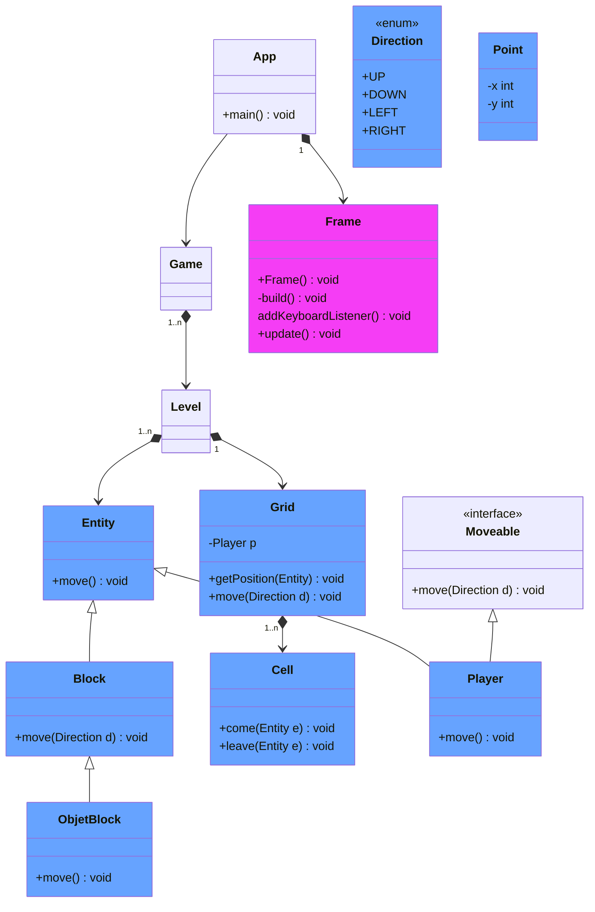

```mermaid
classDiagram

	%% Classes

	class App {
		+main() void
	}

	class Block {
		+move(Direction d) void
	}

	class Cell {
		+come(Entity e) void
		+leave(Entity e) void
	}

	class Direction {
		<<enum>>
		+UP
		+DOWN
		+LEFT
		+RIGHT
	}

	class Entity {
		+move() void
	}

	class Game {

	}

	class Grid {

	}

	class Frame {
		+Frame() void
		-build() void
		addKeyboardListener() void
		+update() void
	}

	class Grid {
		-Player p
		+getPosition(Entity) void
		+move(Direction d) void
	}

	class Level {

	}

	class Moveable {
		<<interface>>
		+move(Direction d) void
	}

	class ObjetBlock {
		+move() void
	}

	class Player {
		+move() void
	}

	class Point {
		-x int
		-y int
	}


	%% Relationships

	App --> Game
	App "1" *--> Frame
	Game "1..n" *--> Level
	Level "1" *--> Grid
	Level "1..n" *--> Entity
	Grid "1..n" *--> Cell
	Entity <|-- Player
	Entity <|-- Block
	Moveable <|-- Player
	Block <|-- ObjetBlock


	%% Styles

	%% Model: #66a3ff
	%% View: #f53df5
	%% Controller: #75f09e

	style Block fill: #66a3ff
	style Cell fill: #66a3ff
	style Direction fill: #66a3ff
	style Entity fill: #66a3ff
	style Frame fill: #f53df5
	style Grid fill: #66a3ff
	style ObjetBlock fill: #66a3ff
	style Player fill: #66a3ff
	style Point fill: #66a3ff
```