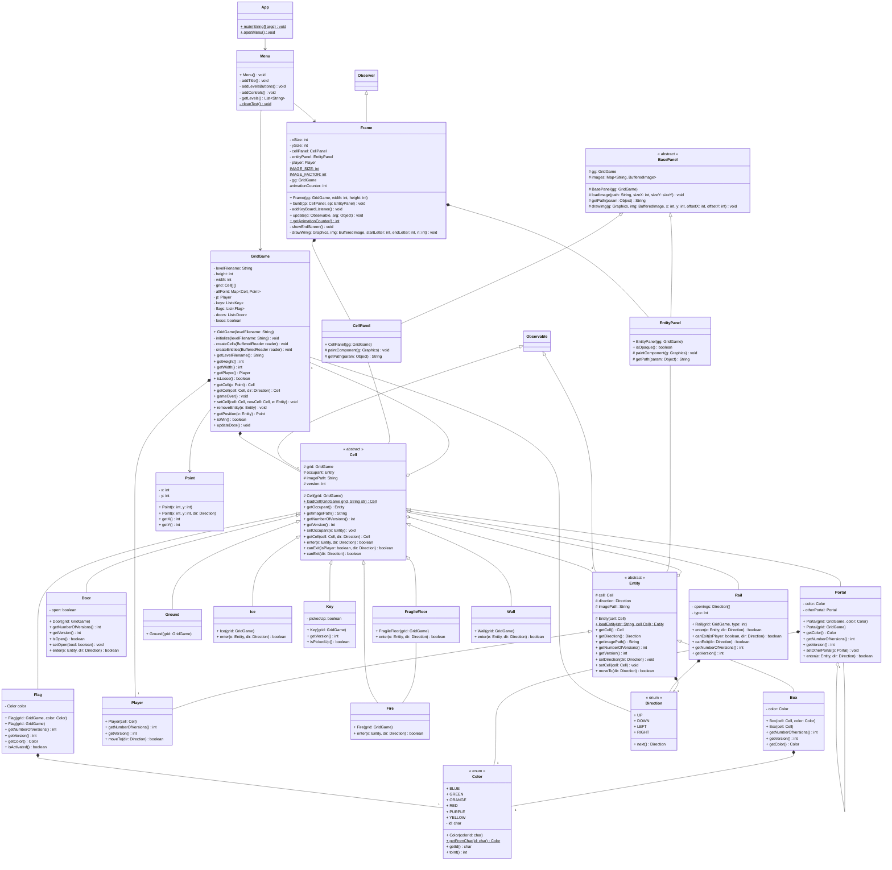

# Diagramme de classe

```mermaid

classDiagram
    %% Classes

    class App {
        + main(String[] args)$ void
        + openMenu()$ void
    }

    class Color {
        << enum >>

        + BLUE
        + GREEN
        + ORANGE
        + RED
        + PURPLE
        + YELLOW
        - id: char

        + Color(colorId: char)
        + getFromChar(id: char)$ Color
        + getId() char
        + toInt() int
    }

    class Entity {
        << abstract >>

        # cell: Cell
        # direction: Direction
        # imagePath: String

        # Entity(cell: Cell)
        + loadEntity(str: String, cell Cell)$ Entity
        + getCell() Cell
        + getDirection() Direction
        + getImagePath() String
        + getNumberOfVersions() int
        + getVersion() int
        + setDirection(dir: Direction) void
        + setCell(cell: Cell) void
        + moveTo(dir: Direction) boolean
    }

    class Box {
        - color: Color

        + Box(cell: Cell, color: Color)
        + Box(cell: Cell)
        + getNumberOfVersions() int
        + getVersion() int
        + getColor() Color
    }

    class Player {
        + Player(cell: Cell)
        + getNumberOfVersions() int
        + getVersion() int
        + moveTo(dir: Direction) boolean
    }

    class Cell {
        << abstract >>

        # grid: GridGame
        # occupant: Entity
        # imagePath: String
        # version: int

        # Cell(grid: GridGame)
        + loadCell(GridGame grid, String str)$ Cell
        + getOccupant() Entity
        + getImagePath() String
        + getNumberOfVersions() int
        + getVersion() int
        + setOccupant(e: Entity) void
        + getCell(cell: Cell, dir: Direction) Cell
        + enter(e: Entity, dir: Direction) boolean
        + canExit(isPlayer: boolean, dir: Direction) boolean
        + canExit(dir: Direction) boolean
    }

    class Door {
        - open: boolean

        + Door(grid: GridGame)
        + getNumberOfVersions() int
        + getVersion() int
        + isOpen() boolean
        + setOpen(bool: boolean) void
        + enter(e: Entity, dir: Direction) boolean
    }

    class Fire {
        + Fire(grid: GridGame)
        + enter(e: Entity, dir: Direction) boolean
    }

    class Flag {
        - Color color

        + Flag(grid: GridGame, color: Color)
        + Flag(grid: GridGame)
        + getNumberOfVersions() int
        + getVersion() int
        + getColor() Color
        + isActivated() boolean
    }

    class FragileFloor {
        + FragileFloor(grid: GridGame)
        + enter(e: Entity, dir: Direction) boolean
    }

    class Ground {
        + Ground(grid: GridGame)
    }

    class Ice {
        + Ice(grid: GridGame)
        + enter(e: Entity, dir: Direction) boolean
    }

    class Key {
        - pickedUp: boolean

        + Key(grid: GridGame)
        + getVersion() int
        + isPickedUp() boolean
    }

    class Portal {
        - color: Color
        - otherPortal: Portal

        + Portal(grid: GridGame, color: Color)
        + Portal(grid: GridGame)
        + getColor() Color
        + getNumberOfVersions() int
        + getVersion() int
        + setOtherPortal(p: Portal) void
        + enter(e: Entity, dir: Direction) boolean
    }

    class Rail {
        - openings: Direction[]
        - type: int

        + Rail(grid: GridGame, type: int)
        + enter(e: Entity, dir: Direction) boolean
        + canExit(isPlayer: boolean, dir: Direction) boolean
        + canExit(dir: Direction) boolean
        + getNumberOfVersions() int
        + getVersion() int
    }

    class Wall {
        + Wall(grid: GridGame)
        + enter(e: Entity, dir: Direction) boolean
    }

    class Direction {
        << enum >>

        + UP
        + DOWN
        + LEFT
        + RIGHT

        + next() Direction
    }

    class GridGame {
        - levelFilename: String
        - height: int
        - width: int
        - grid: Cell[][]
        - allPoint: Map~Cell, Point~
        - p: Player
        - keys: List~Key~
        - flags: List~Flag~
        - doors: List~Door~
        - loose: boolean

        + GridGame(levelFilename: String)
        - initialize(levelFilename: String) void
        - createCells(BufferedReader reader) void
        - createEntities(BufferedReader reader) void
        + getLevelFilename() String
        + getHeight() int
        + getWidth() int
        + getPlayer() Player
        + isLoose() boolean
        + getCell(p: Point) Cell
        + getCell(cell: Cell, dir: Direction) Cell
        + gameOver() void
        + setCell(cell: Cell, newCell: Cell, e: Entity) void
        + removeEntity(e: Entity) void
        + getPosition(e: Entity) Point
        + isWin() boolean
        + updateDoor() void
    }

    class Point {
        - x: int
        - y: int

        + Point(x: int, y: int)
        + Point(x: int, y: int, dir: Direction)
        + getX() int
        + getY() int
    }

    class BasePanel {
        << abstract >>

        # gg: GridGame
        # images: Map~String, BufferedImage~

        # BasePanel(gg: GridGame)
        # loadImage(path: String, sizeX: int, sizeY: sizeY) void
        # getPath(param: Object) String
        # drawImg(g: Graphics, img: BufferedImage, x: int, y: int, offsetX: int, offsetY: int) void
    }

    class CellPanel {
        + CellPanel(gg: GridGame)
        # paintComponent(g: Graphics) void
        # getPath(param: Object) String
    }

    class EntityPanel {
        + EntityPanel(gg: GridGame)
        + isOpaque() boolean
        # paintComponent(g: Graphics) void
        # getPath(param: Object) String
    }

    class Frame {
        - xSize: int
        - ySize: int
        - cellPanel: CellPanel
        - entityPanel: EntityPanel
        - player: Player
        IMAGE_SIZE: int$
        IMAGE_FACTOR: int$
        - gg: GridGame
        animationCounter: int

        + Frame(gg: GridGame, width: int, height: int)
        + build(cp: CellPanel, ep: EntityPanel) void
        - addKeyBoardListener() void
        + update(o: Observable, arg: Object) void
        + getAnimationCounter() int$
        - showEndScreen() void
        - drawWin(g: Graphics, img: BufferedImage, startLetter: int, endLetter: int, n: int) void
    }

    class Menu {
        + Menu() void
        - addTitle() void
        - addLevelsButtons() void
        - addControls() void
        - getLevels() List~String~
        - cleanText()$ void
    }


    %% Relations

    App --> Menu
    Menu --> GridGame
    Menu --> Frame

    GridGame *-- "n" Cell
    GridGame *-- "1" Player
    GridGame --> Point
    GridGame -- Direction

    Observable <|-- Cell
    Cell o-- "1" GridGame
    Cell o-- "1" Entity
    Cell <|-- Door
    Cell <|-- Fire
    Cell <|-- Flag
    Flag *-- "1" Color
    Cell <|-- FragileFloor
    FragileFloor -- Fire
    Cell <|-- Ground
    Cell <|-- Ice
    Cell <|-- Key
    Cell <|-- Portal
    Portal *-- "1" Color
    Portal o-- "1" Portal
    Cell <|-- Rail
    Rail *-- "n" Direction
    Cell <|-- Wall

    Observable <|-- Entity
    Entity o-- "1" Cell
    Entity *-- "1" Direction
    Entity <|-- Player
    Entity <|-- Box
    Box *-- "1" Color

    Observer <|-- Frame
    Frame *-- CellPanel
    Frame *-- EntityPanel
    BasePanel <|-- CellPanel
    BasePanel <|-- EntityPanel
    CellPanel -- Cell
    EntityPanel -- Entity
```
