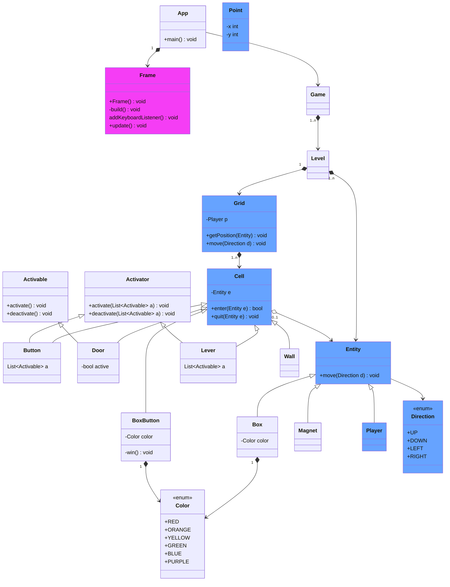

```mermaid
classDiagram

	%% Classes

	class App {
		+main() void
	}

	class Box {
		-Color color
	}

	class BoxButton {
		-Color color
		-win() void
	}

	class Button {
		List~Activable~ a
	}

	class Cell {
		-Entity e
		+enter(Entity e) bool
		+quit(Entity e) void
	}

	class Door {
		-bool active
	}

	class Entity {
		+move(Direction d) void
	}

	class Frame {
		+Frame() void
		-build() void
		addKeyboardListener() void
		+update() void
	}

	class Game {

	}

	class Grid {
		-Player p
		+getPosition(Entity) void
		+move(Direction d) void
	}

	class Level {

	}

	class Magnet {

	}

	class Lever {
		List~Activable~ a
	}

	class Player {

	}

	class Point {
		-x int
		-y int
	}

	class Wall {

	}


	%% Enums

	class Direction {
		<<enum>>
		+UP
		+DOWN
		+LEFT
		+RIGHT
	}

	class Color {
		<<enum>>
		+RED
		+ORANGE
		+YELLOW
		+GREEN
		+BLUE
		+PURPLE
	}


	%% Interfaces

	class Activable {
		+activate() void
		+deactivate() void
	}

	class Activator {
		+activate(List~Activable~ a) void
		+deactivate(List~Activable~ a) void
	}


	%% Relationships

	App --> Game
	App "1" *--> Frame
	Game "1..n" *--> Level
	Level "1" *--> Grid
	Level "1..n" *--> Entity
	Grid "1..n" *--> Cell
	Cell "0..1" o--> Entity
	Cell <|-- BoxButton
	Cell <|-- Door
	Cell <|-- Button
	Cell <|-- Lever
	Cell <|-- Wall
	Entity --> Direction
	Entity <|-- Box
	Entity <|-- Magnet
	Entity <|-- Player
	Box "1" *--> Color
	BoxButton "1" *--> Color

	Activator <|-- Button
	Activator <|-- Lever
	Activable <|-- Door


	%% Styles

	%% Model: #66a3ff
	%% View: #f53df5
	%% Controller: #75f09e

	style Block fill: #66a3ff
	style Cell fill: #66a3ff
	style Direction fill: #66a3ff
	style Entity fill: #66a3ff
	style Frame fill: #f53df5
	style Grid fill: #66a3ff
	style Player fill: #66a3ff
	style Point fill: #66a3ff
```